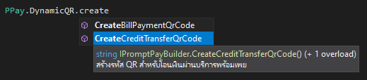

# Prompt Pay (EMVCo)

## ติดตั้ง
อยากเอาไปใช้ก็ติดตั้งผ่าน nuget ได้เลย หรือจะใช้ .NET CLI ก็ได้เช่นกันขอรับ
```
dotnet add package Saladpuk.PromptPay
```

> ใครอยากเอาไปปู้ยี้ปู้ยำอะไรก็ตามสบาย ถ้าทำแล้วดีหรือเจอจุดผิดก็ฝาก `pull-request` เข้ามาด้วยจะเป็นประคุณมาก
> โค้ดตัวนี้ใช้ .NET Standard 2.0 นะจ๊ะ

มีคำอธิบายเป็นภาษาไทย เพื่อให้นักพัฒนาชาวไทยสามารถเข้าถึงได้ง่าย



## การใช้งาน
QR ตามมาตรฐานของ EMVCo ได้แบ่งไว้ 2 ลักษณะการใช้งานคือ
1. **Static QR** เป็น QR ประเภทใช้จ่ายเงินได้หลายครั้ง (ใช้ซ้ำได้)
1. **Dynamic QR** เป็น QR ประเภทจ่ายเงินได้เพียงครั้งเดียวแล้วทิ้ง (ใช้ซ้ำไม่ได้)

สำหรับโค้ดในการสร้าง QR แต่ละรูปแบบก็ตามด้านล่างนี่แหละ
```csharp
// Static QR
IPromptPayBuilder builder = PPay.StaticQR;

// Dynamic QR
IPromptPayBuilder builder = PPay.DynamicQR;
```

ตัวโค้ดที่เขียนไว้ได้เพิ่มความสามารถในการ **ถอดความหมาย** ของ `EMVCo` และ `PromptPay` เอาไว้ด้วย โดยสามารถเรียกใช้งานตามด้านล่าง
```csharp
// ตัวอ่าน QR ตามมาตรฐาน EMVCo และ PromptPay
IPromptPayQrReader reader = PPay.Reader;
```

# การสร้าง QR
## 1.สร้าง QR โอนเงินสำหรับบุคคลทั่วไป (Credit Transfer - Tag 29)
เป็นการโอนเงินระหว่างประชาชนทั่วไปไม่เกี่ยวกับธุรกิจหรือบริษัทใดๆ โดยการสร้าง QR ประเภทนี้ จะต้องเรียกใช้ผ่านเมธอด `CreateCreditTransferQrCode()` ตามโค้ดด้านล่างนี้
```csharp
// สร้าง QR โอนเงินสำหรับบุคคลทั่วไป
string qr = PPay.StaticQR.CreateCreditTransferQrCode();
```

### การระบุผู้รับเงิน
ตามมาตรฐานของธนาคารแห่งประเทศไทย เราสามารถระบุผู้รับเงินได้ 4 วิธีคือ `เบอร์มือถือ`, `เลขประจำตัวประชาชน`, `เลขบัญชีธนาคาร` และ `e-wallet` ตามโค้ดตัวอย่างด้านล่างนี้

1. ระบุผู้รับเงินด้วย `เบอร์มือถือ`
```csharp
// โอนเงินพร้อมเพย์ไปที่ เบอร์มือถือ 091-418-5401 (จำนวนเงินที่จะโอนผู้ใช้ต้องกรอกเอง)
string qr = PPay.StaticQR.MobileNumber("0914185401").CreateCreditTransferQrCode();
```

2. ระบุผู้รับเงินด้วย `เลขประจำตัวประชาชน`
```csharp
// โอนเงินพร้อมเพย์ไปที่ เลขประจำตัวประชาชน 0-0000-00000-00-0 (จำนวนเงินที่จะโอนผู้ใช้ต้องกรอกเอง)
string qr = PPay.StaticQR.NationalId("0000000000000").CreateCreditTransferQrCode();
```

3. ระบุผู้รับเงินด้วย `เลขบัญชีธนาคาร`
```csharp
// โอนเงินพร้อมเพย์ไปที่ เลขบัญชีธนาคาร 0000000000 (จำนวนเงินที่จะโอนผู้ใช้ต้องกรอกเอง)
string qr = PPay.StaticQR.BankAccount("000000000000000").CreateCreditTransferQrCode();
```

4. ระบุผู้รับเงินด้วย `e-wallet`
```csharp
// โอนเงินพร้อมเพย์ไปที่ e-Wallet Id 000000000000000 (จำนวนเงินที่จะโอนผู้ใช้ต้องกรอกเอง)
string qr = PPay.StaticQR.EWallet("000000000000000").CreateCreditTransferQrCode();
```

### การกำหนดจำนวนเงินที่ต้องจ่าย
เราสามารถสร้าง QR ที่มีการกำหนดเงินที่ต้องจ่ายเป็นค่าตายตัวได้เลย โดยการเรียกใช้เมธอด `Amount()` ตามโค้ดตัวอย่างด้านล่าง
```csharp
// โอนเงินพร้อมเพย์ไปที่ เบอร์มือถือ 091-418-5401 จำนวน 50 บาท
string qr = PPay.StaticQR.MobileNumber("0914185401").Amount(50).CreateCreditTransferQrCode();

// โอนเงินพร้อมเพย์ไปที่ เลขประจำตัวประชาชน 0-0000-00000-00-0 จำนวน 50 บาท
string qr = PPay.StaticQR.NationalId("0000000000000").Amount(50).CreateCreditTransferQrCode();


// โอนเงินพร้อมเพย์ไปที่ เลขบัญชีธนาคาร 0000000000 จำนวน 50 บาท
string qr = PPay.StaticQR.BankAccount("000000000000000").Amount(50).CreateCreditTransferQrCode();

// โอนเงินพร้อมเพย์ไปที่ e-Wallet Id 000000000000000 จำนวน 50 บาท
string qr = PPay.StaticQR.EWallet("000000000000000").Amount(50).CreateCreditTransferQrCode();
```

สำหรับคนที่อยากสร้าง QR โดยไม่ต้องรู้เรื่องอะไรเลยก็สามารถเรียกใช้งานแบบนี้ได้
```csharp
// โอนเงินพร้อมเพย์ไปที่ เลขประจำตัวประชาชน 0-0000-00000-00-0
string qr = PPay.StaticQR
    .CreateCreditTransferQrCode(new CreditTransfer
    {
        NationalIdOrTaxId = "0000000000000"
    });
Console.WriteLine($"Credit Transfer (PID): {creditTransferQR2}");
```

### เพิ่มเติม
กรณีที่เป็น QR ประเภท **ร้านเป็นผู้แสดง QR ให้ลูกค้าสแกน** สามารถกำหนดโดยเรียกใช้เมธอด `MerchantPresentedQR()`
```csharp
string qr = PPay.StaticQR.MerchantPresentedQR().CreateCreditTransferQrCode();
```

กรณีที่เป็น QR ประเภท **ลูกค้าเป็นผู้แสดง QR Code ให้ร้านค้าสแกน** สามารถกำหนดโดยเรียกใช้เมธอด `CustomerPresentedQR()`
```csharp
string qr = PPay.StaticQR.CustomerPresentedQR().CreateCreditTransferQrCode();
```

## 2.สร้าง QR สำหรับธุรกิจ (Bill Payment - Tag 30)
เป็นการสร้าง QR สำหรับเรียกเก็บเงินจาก ร้านค้า/บริษัท โดยการสร้าง QR ประเภทนี้ จะต้องเรียกใช้ผ่านเมธอด `CreateBillPaymentQrCode()` ตามโค้ดด้านล่างนี้
```csharp
// สร้าง QR สำหรับธุรกิจ
string qr = PPay.StaticQR.CreateBillPaymentQrCode();
```

### การระบุผู้รับเงิน
ตามมาตรฐานของธนาคารแห่งประเทศไทย ตัว QR ประเภทนี้สามารถกำหนดผู้รับเงินได้ 2 วิธีคือ `รหัสประจำตัวประชาชน` หรือ `เลขประจำตัวผู้เสียภาษี` ตามด้วยรหัสร้านสาขา (suffix) ต่อท้าย 2 ตัว และรหัสอ้างอิงเพื่อเอาไว้ยืนยันกับธนาคารกรณีมีปัญหา ตามโค้ดตัวอย่างด้านล่างนี้

1. ระบุผู้รับเงินด้วย `รหัสประจำตัวประชาชน`
```csharp
// จ่ายเงินพร้อมเพย์ไปที่ รหัสประชาชน 0-0000-00000-00-0 รหัสร้านสาขา 99 (2 หลัก)
// รหัสอ้างอิง 1: 1234, รหัสอ้างอิง 2: 5678
string qr = PPay.StaticQR
    .NationalId("0000000000000")
    .BillerSuffix("99")
    .BillRef1("1234")
    .BillRef2("5678")
    .CreateBillPaymentQrCode();
```

2. ระบุผู้รับเงินด้วย `เลขประจำตัวผู้เสียภาษี`
```csharp
// จ่ายเงินพร้อมเพย์ไปที่ เลขประจำตัวผู้เสียภาษี 0-0000-00000-00-0 รหัสร้านสาขา 99 (2 หลัก)
// รหัสอ้างอิง 1: 1234, รหัสอ้างอิง 2: 5678 (จำนวนเงินที่จะโอนผู้ใช้ต้องกรอกเอง)
string qr = PPay.StaticQR
    .TaxId("000000000000099")
    .BillerSuffix("99")
    .BillRef1("1234")
    .BillRef2("5678")
    .CreateBillPaymentQrCode();
```

### การกำหนดจำนวนเงินที่ต้องจ่าย
เราสามารถสร้าง QR ที่มีการกำหนดเงินที่ต้องจ่ายเป็นค่าตายตัวได้เลย โดยการเรียกใช้เมธอด `Amount()` ตามโค้ดตัวอย่างด้านล่าง
```csharp
// จ่ายเงินพร้อมเพย์ไปที่ เลขประจำตัวผู้เสียภาษี 0-0000-00000-00-0 รหัสร้านสาขา 99 (2 หลัก)
// รหัสอ้างอิง 1: 1234, รหัสอ้างอิง 2: 5678 จำนวน 50 บาท
string qr = PPay.StaticQR
    .TaxId("000000000000099")
    .BillerSuffix("99")
    .BillRef1("1234")
    .BillRef2("5678")
    .Amount(50)
    .CreateBillPaymentQrCode();
```

สำหรับคนที่อยากสร้าง QR โดยไม่ต้องรู้เรื่องอะไรเลยก็สามารถเรียกใช้งานแบบนี้ได้
```csharp
// จ่ายเงินพร้อมเพย์ไปที่ เลขประจำตัวผู้เสียภาษี 0-0000-00000-00-0 รหัสร้านสาขา 99 (2 หลัก)
// รหัสอ้างอิง 1: 1234, รหัสอ้างอิง 2: 5678 (จำนวนเงินที่จะโอนผู้ใช้ต้องกรอกเอง)
string qr = PPay.DynamicQR
    .CreateBillPaymentQrCode(new BillPayment
    {
        BillerId = "000000000000099",
        Suffix = "02",
        Reference1 = "1234",
        Reference2 = "5678",
    });
```

### เพิ่มเติม
กรณีที่เป็น QR ประเภท **ใช้ภายในประเทศ** สามารถกำหนดโดยเรียกใช้เมธอด `DomesticMerchant()`
```csharp
string qr = PPay.StaticQR.DomesticMerchant().CreateBillPaymentQrCode();
```

กรณีที่เป็น QR ประเภท **ใช้ข้ามประเทศ** สามารถกำหนดโดยเรียกใช้เมธอด `CrossBorderMerchant()`
```csharp
string qr = PPay.StaticQR.CrossBorderMerchant().CreateBillPaymentQrCode();
```

# ตัวถอดความหมาย QR
ในกรณีที่เราได้รับ QR code ที่เป็นข้อความยาวๆเข้ามา แล้วเราต้องการรู้ความหมายของมัน เราสามารถเรียกใช้งานตัว QR Reader ได้ด้วยคำสั่งด้านล่างนี้ (คำสั่งนี้รอบรับมาตรฐาน `EMVCo` และ `PromptPay`)
```csharp
// QR โอนเงินพร้อมเพย์ไปยังเบอร์โทร 0914185401 จำนวนเงิน 50 บาท
string qr = "00020101021229370016A000000677010111011300669141854015303764540550.005802TH630401F8";
IPromptPayQrInfo model = PPay.Reader.ReadQrPromptPay(qr);
```

**ผลลัพท์**
```
{
    "Segments": 
    [
        {
            "RawValue": "000201",
            "Id": "00",
            "Length": "02",
            "Value": "01",
            "IdByConvention": 0
        },
        {
            "RawValue": "010212",
            "Id": "01",
            "Length": "02",
            "Value": "12",
            "IdByConvention": 1
        },
        {
            "RawValue": "29370016A00000067701011101130066914185401",
            "Id": "29",
            "Length": "37",
            "Value": "0016A00000067701011101130066914185401",
            "IdByConvention": 2
        },
        {
            "RawValue": "5303764",
            "Id": "53",
            "Length": "03",
            "Value": "764",
            "IdByConvention": 53
        },
        {
            "RawValue": "540550.00",
            "Id": "54",
            "Length": "05",
            "Value": "50.00",
            "IdByConvention": 54
        },
        {
            "RawValue": "5802TH",
            "Id": "58",
            "Length": "02",
            "Value": "TH",
            "IdByConvention": 58
        },
        {
            "RawValue": "630401F8",
            "Id": "63",
            "Length": "04",
            "Value": "01F8",
            "IdByConvention": 63
        }
    ],
    "PayloadFormatIndicator": "01",
    "PointOfInitiationMethod": "12",
    "MerchantAccountInformation": "0016A00000067701011101130066914185401",
    "MerchantCategoryCode": null,
    "TransactionCurrency": "764",
    "TransactionAmount": "50.00",
    "TipOrConvenienceIndicator": null,
    "ValueOfConvenienceFeeFixed": null,
    "ValueOfConvenienceFeePercentage": null,
    "CountryCode": "TH",
    "MerchantName": null,
    "MerchantCity": null,
    "PostalCode": null,
    "AdditionalData": null,
    "CRC": "01F8",
    "MerchantInformationLanguageTemplate": null,
    "RFU": null,
    "Reusable": true,
    "Currency": "THB",
    "CreditTransfer": {
        "AID": "A000000677010111",
        "MobileNumber": "66914185401",
        "NationalIdOrTaxId": null,
        "EWalletId": null,
        "BankAccount": null,
        "OTA": null,
        "CustomerPresentedQR": false
    },
    "BillPayment": null
}
```

## อ้างอิง
ตัวช่วยในการ `อ่าน` และ `สร้าง` QR Prompt Pay ตามมาตรฐานของธนาคารแห่งประเทศไทย **BOT** (Bank of Thailand) โดยอ้างอิงจากเอกสารสำคัญ 3 ตัวด้านล่างนี้
1. [Thai QR Code - Payment Standard](https://www.bot.or.th/Thai/PaymentSystems/StandardPS/Documents/ThaiQRCode_Payment_Standard.pdf)
1. [ENVCo Consumer Presented Mode](https://www.emvco.com/wp-content/plugins/pmpro-customizations/oy-getfile.php?u=/wp-content/uploads/documents/EMVCo-Consumer-Presented-QR-Specification-v1-1.pdf)
1. [EMVCo Merchant Presented Mode](https://www.emvco.com/wp-content/plugins/pmpro-customizations/oy-getfile.php?u=/wp-content/uploads/documents/EMVCo-Merchant-Presented-QR-Specification-v1-1.pdf)

## Progress
|Feature|สถานะ|หมายเหตุ|
|--|--|--|
|สร้าง Bill Payment|ใช้งานได้|เทสเคสยังไม่ครอบคลุมพอ|
|สร้าง Transfer with PromptPay ID|ใช้งานได้|เทสเคสยังไม่ครอบคลุมพอ + ตัดเบอร์โทรกากๆไปก่อน|
|ถอดความหมาย QR|ใช้งานได้|เทสเคสยังไม่ครอบคลุมพอ + ยังถอดไม่ครบทุกฟิลด์|
|Validators & Suggestion|ยังไม่ได้ทำ||
